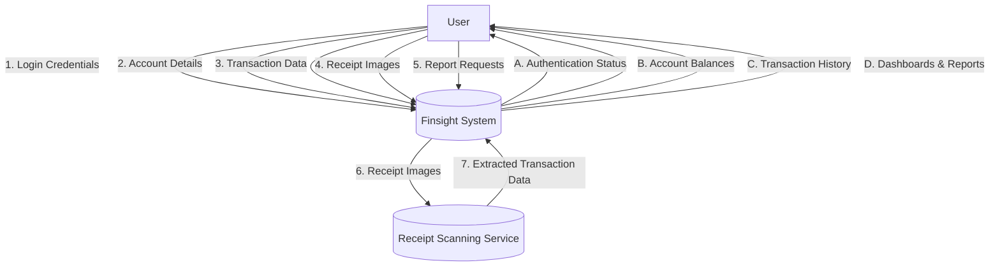
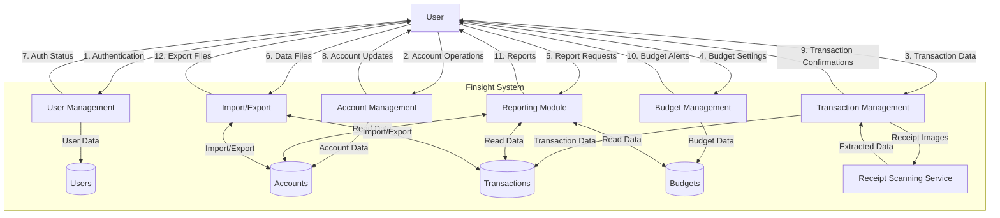
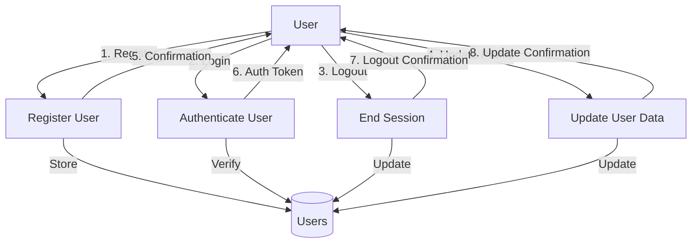
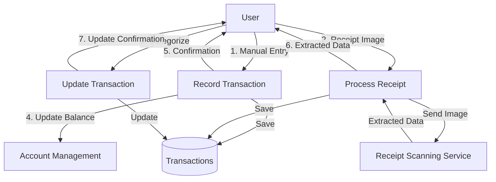
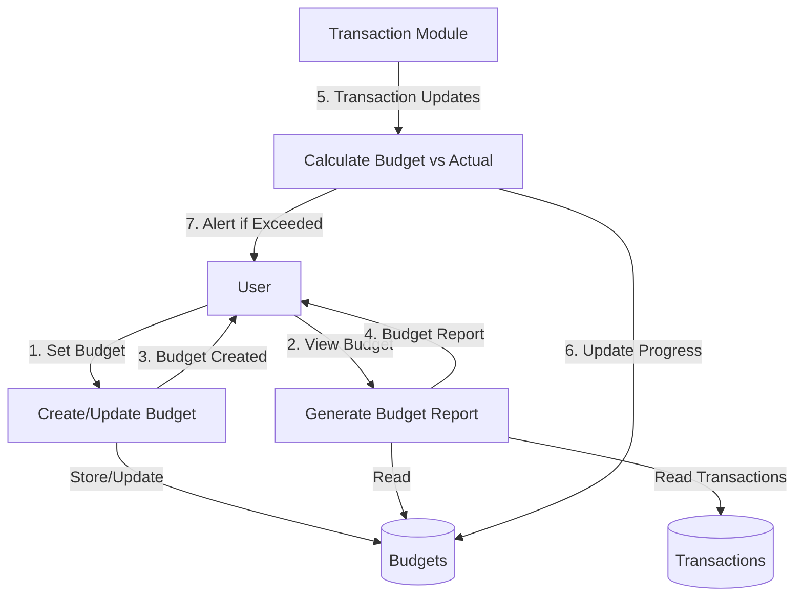
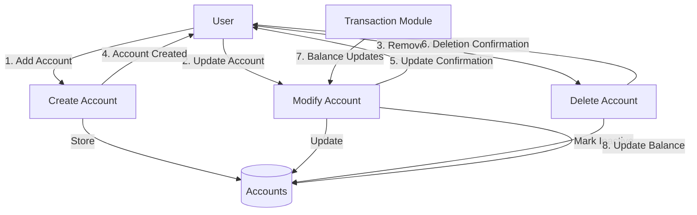
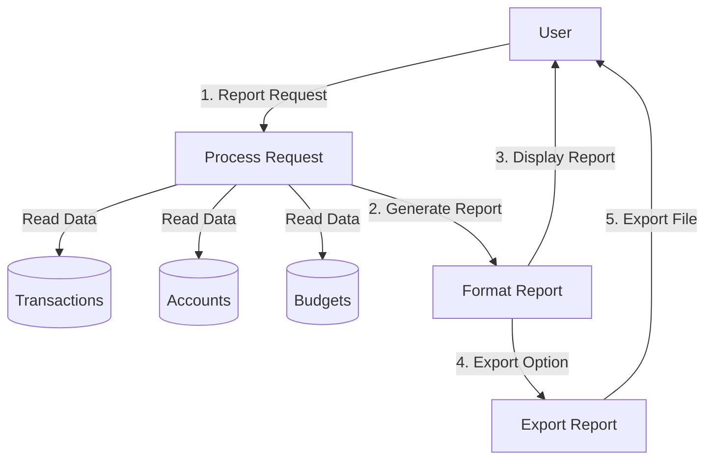
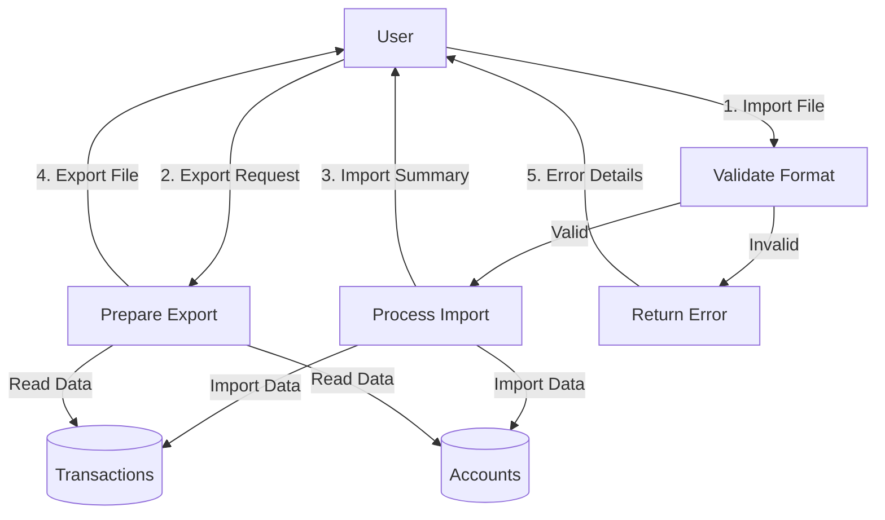

# Finsight - Data Flow Diagrams (DFD)

## Table of Contents
1. [Level 0: Context Diagram](#level-0-context-diagram)
2. [Level 1: System Overview](#level-1-system-overview)
3. [Level 2: Module Details](#level-2-module-details)
   - [User Management Module](#user-management-module)
   - [Transaction Management Module](#transaction-management-module)
   - [Budget Management Module](#budget-management-module)
   - [Account Management Module](#account-management-module)
   - [Reporting and Analysis Module](#reporting-and-analysis-module)
   - [Data Import/Export Module](#data-importexport-module)

## Level 0: Context Diagram

**Data Flows:**
1. User credentials for authentication
2. Account details for management
3. Transaction data for recording
4. Receipt images for processing
5. Report generation requests
6. Receipt images for scanning
7. Extracted transaction data

## Level 1: System Overview

## Level 2: Module Details

### User Management Module

### Transaction Management Module

### Budget Management Module

### Account Management Module

### Reporting and Analysis Module

### Data Import/Export Module

## Data Dictionary

### Data Stores

**Users**
- user_id (PK)
- email
- password_hash
- full_name
- created_at
- last_login

**Accounts**
- account_id (PK)
- user_id (FK)
- account_name
- account_type
- balance
- currency
- is_active
- created_at

**Transactions**
- transaction_id (PK)
- account_id (FK)
- amount
- date
- category_id (FK)
- description
- type (income/expense)
- created_at

**Budgets**
- budget_id (PK)
- user_id (FK)
- category_id (FK)
- amount
- period (monthly/yearly)
- start_date
- end_date
- created_at

**Categories**
- category_id (PK)
- name
- type (income/expense)
- user_id (FK, NULL for default categories)
- icon
- color

## Notes

1. All diagrams follow standard DFD notation:
   - External entities: Rectangles
   - Processes: Rounded rectangles
   - Data stores: Open-ended rectangles
   - Data flows: Arrows with labels

2. Security considerations:
   - Authentication required for all user interactions
   - Data validation at all entry points
   - Input sanitization to prevent injection attacks

3. Performance considerations:
   - Caching frequently accessed data
   - Indexing for frequently queried fields
   - Batch processing for large data exports

4. Error handling:
   - Clear error messages for user actions
   - Logging of system errors
   - Data validation before processing

5. Future extensions:
   - Multi-currency support
   - Bank integration
   - Investment tracking
   - Tax preparation features
